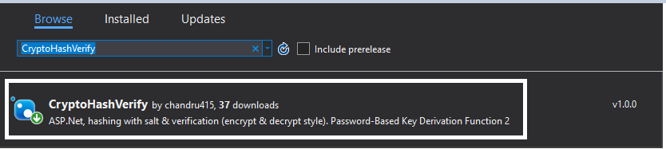
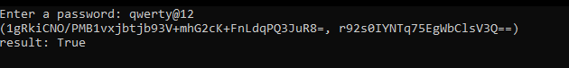

 <h2 align="center">crypto-hash-verify</h2>
 
Encrypt & Decrypt sensitive value with salt using <b>Password Key Derivation Function 2</b>

  
 

 
 
  
 

 

---

 **crypto-hash-verify** gives the ability to encrypt and decrypt sensitive data using the key derivation function(s). 

To install the *package* to any .Net Core application please click [here](https://www.nuget.org/packages/CryptoHashVerify/).

<h4> Use case: password encrypt & decrypt </h4>

* Create .Net core console application (C#)

* Under project dependencies - add CryptoHashVerify from the nuget package manager.

* ***GenerateHashString*** method will return a tuple consists 
  * hashed password
  * salt value

 

*output*

 

* ***VerifyHashString*** method will return a true password matches otherwise false.

 

### Show some ❤️ by starring some of the repositories!

